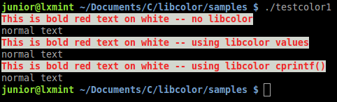

libcolor
========

A static C library to output colored text to the console.

Why ?
-----

Output colored text to the console is quite easy. Before the text, you have to print "special characters" to set the colors and style (font color, background color, bold text).

However, the color characters are not easy to handle, and makes your printf look horrible.
libcolor supplies all color characters and a printf-like function to output colored text without going crazy.

Have a look at the following example : 

``` C
#include <stdio.h>

#include "color.h" // from libcolor

int main(void) {
  // The last color characters (\e[m or COLOR_NORMAL from libcolor) is used to reset the colors at the end of the printf.
  // If you don't reset the colors, the colors will be apply to the following printf ("normal text" printf in this example).
  printf("\e[31m\e[47m\e[1mThis is bold red text on white -- no libcolor\e[m\n");
  printf("normal text\n");
  printf(COLOR_RED COLOR_BG_WHITE COLOR_BOLD "This is bold red text on white -- using libcolor values\n" COLOR_NORMAL);
  printf("normal text\n");
  cprintf(RED, WHITE, BOLD, "This is bold red text on white -- using libcolor cprintf()\n");
  printf("normal text\n");
  return 0;
}
```

and the output :



How to build
------------

Use the makefile to build the lib (bin/libcolor.a):
``` bash
make # Build the lib and the samples
make clean # Clean the temporary and objects file.
```

If you want to remove the lib and all the temporary files:
``` bash
make distclean
```

Tools
-----

- Written with Emacs 24
- Built with gcc 4.8
- Tested on GNU/Linux (Linux Mint 16)
